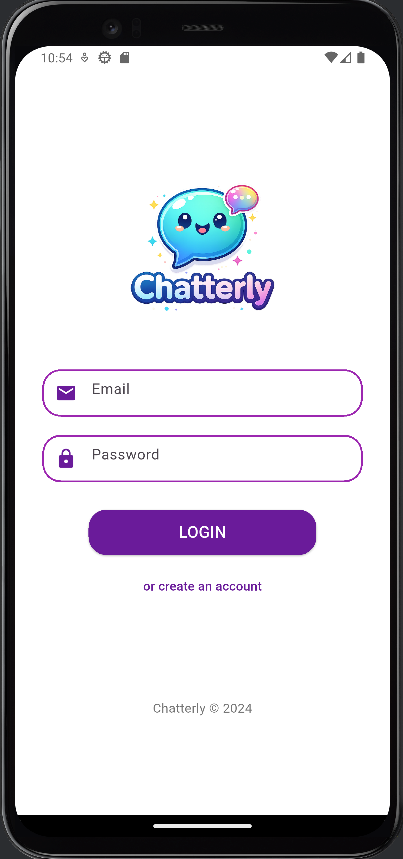
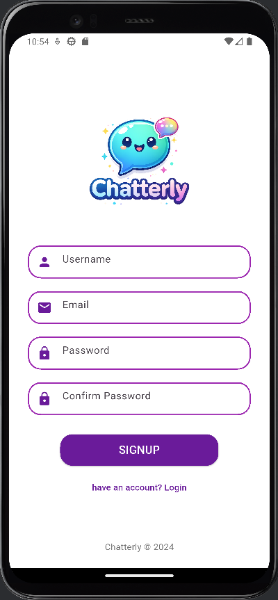
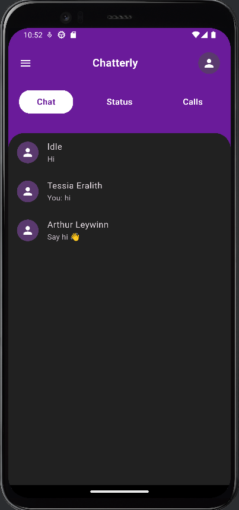
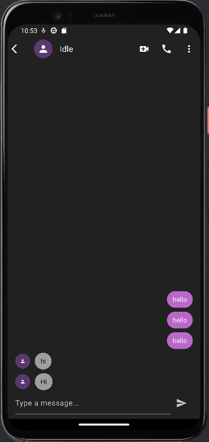
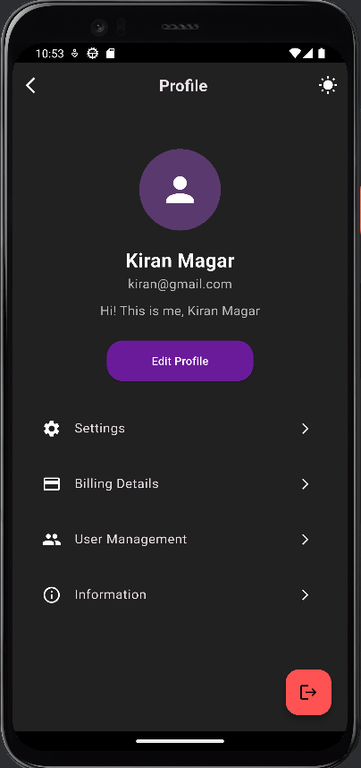
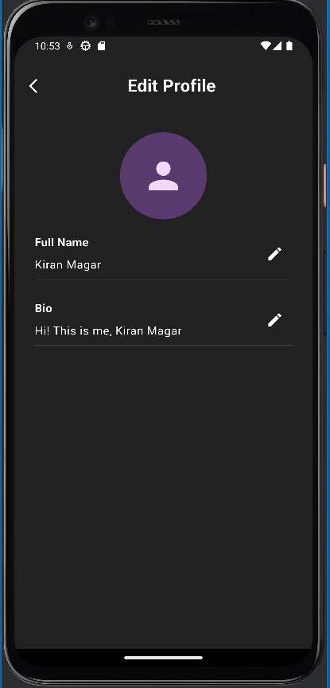

# Chatterly 💬

Chatterly is a real-time chat application built with **Flutter** and **Firebase**, supporting user authentication, profile editing, and modern light/dark UI design.

---

## 🚀 Features

- 🔐 Firebase Authentication (Email & Password)
- 💬 Real-time chat using Cloud Firestore
- 👤 User profiles with editable name & bio
- 🌓 Light & Dark mode support
- 📱 Clean and responsive Flutter UI
- 🔒 Secure user sessions

---

## 🛠 Tech Stack

- **Flutter**
- **Dart**
- **Firebase Authentication**
- **Cloud Firestore**
- **Firebase Storage** (for profile images – optional)
- **Material UI**

---

## 📸 Screenshots

## 📸 Screenshots (Dark Mode)

### Login


### Signup


### Home


### Chat


### Profile


### Edit Profile



---

## ⚙️ Getting Started

### 1️⃣ Clone the repository

```bash
git clone https://github.com/Idle-del/Chatterly-Flutter.git
cd Chatterly-Flutter
